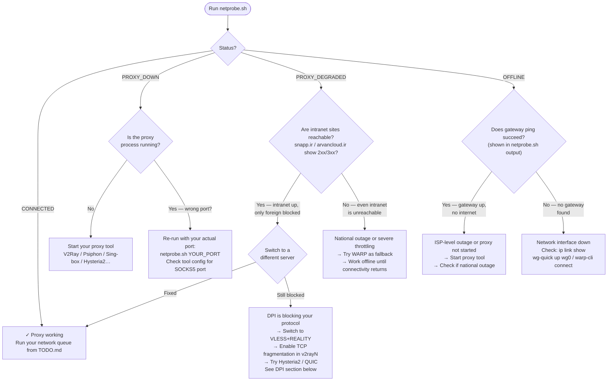

# Linux & macOS — Setup, Diagnostics, and DPI Guide

Supplement to `SKILL.md`. Start here if `netprobe.sh` returned anything other than `CONNECTED`, or if you need to configure your proxy tool for the first time.

---

## Quick-start: proxy environment variables

Set these before running `claude`. The `socks5h://` scheme makes the proxy resolve DNS — critical where DNS is poisoned.

```bash
export HTTPS_PROXY="socks5h://127.0.0.1:10808"
export HTTP_PROXY="socks5h://127.0.0.1:10808"
export all_proxy="socks5h://127.0.0.1:10808"
export no_proxy="localhost,127.0.0.1"
claude
```

Replace `10808` with your actual SOCKS5 port if different (see port table in `SKILL.md`).

To persist across terminals, add the `export` lines to `~/.bashrc` or `~/.zshrc`.

To unset:
```bash
unset HTTPS_PROXY HTTP_PROXY all_proxy
```

---

## Diagnostic flowchart

Run `netprobe.sh` first, then follow the path for your result:

```bash
bash .claude-session/scripts/netprobe.sh 10808   # your SOCKS5 port
```



> **Offline use:** this flowchart renders in VS Code Markdown Preview, Obsidian, and Typora.

---

## Diagnosing PROXY_DEGRADED in detail

Local network up, proxy running, but foreign endpoints unreachable through it.

**Step 1 — Is it a DPI protocol block?**

The most common cause. Your proxy software is running but the VPN protocol is being fingerprinted and throttled or blocked at the ISP level. Symptoms: GitHub, PyPI, and npm all return `CONNECT_FAIL` or timeout simultaneously. Fix: switch to a DPI-resistant protocol (see table below).

**Step 2 — Is the remote server itself blocked?**

The server's IP may be blocked rather than the protocol. Symptoms: one server fails but switching to another in your subscription fixes it. Fix: update your subscription, switch servers.

**Step 3 — Is it a blanket outage?**

If everything fails simultaneously (intranet also unreachable), it is likely a national-level event, not a local config issue. Try Cloudflare WARP as a fallback — it uses a different routing path.

**Step 4 — Hysteria2 over QUIC**

QUIC is UDP-based. Most DPI tools are optimized for TCP and have limited visibility into QUIC traffic. If TCP-based proxies are throttled, Hysteria2 often works when V2Ray does not.

---

## Checking if a proxy port is listening

### Linux
```bash
ss -tlnp | grep :10808
# or
nc -z -w 2 127.0.0.1 10808 && echo "UP" || echo "DOWN"
```

### macOS
```bash
lsof -i :10808 -sTCP:LISTEN
# or
nc -z -w 2 127.0.0.1 10808 && echo "UP" || echo "DOWN"
```

---

## Tool-specific setup

### V2Ray / Xray

Most common in Iran. Default: SOCKS5 on 10808, HTTP on 10809.

```bash
# Config locations
~/.config/v2ray/config.json
/usr/local/etc/v2ray/config.json     # Linux package install
/usr/local/etc/xray/config.json      # Xray

# Start (Linux systemd)
systemctl start v2ray
systemctl status v2ray

# Start manually
v2ray run -config ~/.config/v2ray/config.json

# macOS (Homebrew)
brew services start v2ray
```

### Psiphon

```bash
# Linux: download AppImage from psiphon3.com
chmod +x Psiphon3.AppImage
./Psiphon3.AppImage
# SOCKS5 on 1080, HTTP on 8080 by default

# macOS: .dmg installer available
```

### Cloudflare WARP

```bash
# Linux
warp-cli connect
warp-cli status
# Creates warp0 interface or SOCKS5 on 40000

# macOS — use the system tray app, or:
/Applications/Cloudflare\ WARP.app/Contents/Resources/warp-cli connect
```

Verify interface (Linux):
```bash
ip link show warp0
ip addr show warp0
```

Verify interface (macOS):
```bash
ifconfig | grep -A4 CloudflareWARP
networksetup -listallnetworkservices
```

No proxy env vars needed when using WARP in full-tunnel mode — all traffic routes through the interface.

### WireGuard

WireGuard creates a network interface — there is no SOCKS5 port to probe. `netprobe.sh` skips the foreign endpoint layer (Layer 3) entirely when no SOCKS5 port is given. Test foreign reachability directly instead:

```bash
curl -s -o /dev/null -w "%{http_code}" https://github.com
```

```bash
# Linux
wg show
sudo wg-quick up wg0

# macOS — use the WireGuard app from the App Store, or:
wg show
```

The gateway ping in `netprobe.sh` (Layer 2a) still works and tells you if the interface is alive.

### Sing-box

```bash
# Typically SOCKS5 on 2080, HTTP on 2081 (configurable)
sing-box run -c config.json

# Check config for actual ports:
grep -i "socks\|http\|listen" config.json
```

### Hysteria2 / TUIC

```bash
# Typically SOCKS5 on 1080 (configurable)
hysteria2 client -c config.yaml

# Check config:
grep -i "socks\|listen\|port" config.yaml
```

Hysteria2 uses QUIC (UDP), which performs well under packet loss and partial outages.

### Shadowsocks

```bash
# SOCKS5 on 1080 (configurable)
ss-local -c config.json
# or via shadowsocks-libev:
ss-local -s SERVER -p PORT -l 1080 -k PASSWORD -m METHOD
```

---

## macOS system-wide proxy (alternative to env vars)

```bash
# Set SOCKS5 proxy for Wi-Fi
networksetup -setsocksfirewallproxy Wi-Fi 127.0.0.1 10808
networksetup -setsocksfirewallproxystate Wi-Fi on

# Verify
networksetup -getsocksfirewallproxy Wi-Fi

# Disable
networksetup -setsocksfirewallproxystate Wi-Fi off
```

Note: system-wide proxy settings affect GUI apps but not all terminal tools. `curl` and `pip` respect env vars more reliably than system settings.

---

## DPI — making `claude` more reliable

DPI (Deep Packet Inspection) can identify and block specific TLS connections even when a proxy is running. The TLS ClientHello to `api.anthropic.com` contains the SNI in plaintext — DPI can read it on encrypted connections.

### Protocol resistance (strongest to weakest)

| Protocol | DPI resistance | Notes |
|----------|---------------|-------|
| VLESS + REALITY | Excellent | Mimics real TLS to a legitimate domain. Gold standard. |
| VLESS + Vision + TLS | Very good | XTLS splice mode, minimal overhead |
| Trojan + TLS | Good | Looks like standard HTTPS traffic |
| VMess + WebSocket + TLS | Good | Works through CDN fronting |
| Hysteria2 (QUIC/UDP) | Good | UDP-based; DPI tools often can't deep-inspect QUIC |
| Plain VMess / Shadowsocks | Poor | Fingerprinted and blocked more easily |

### TCP fragmentation (v2rayN built-in)

v2rayN can split the TLS ClientHello into small TCP segments. DPI engines that reassemble packets partially often miss the SNI in a fragmented ClientHello.

Enable in v2rayN: **Settings → Core: Xray → (edit config JSON)**, add to outbound:

```json
"sockopt": {
  "dialerProxy": "fragment",
  "fragment": {
    "packets": "tlshello",
    "length": "100-200",
    "interval": "10-20"
  }
}
```

Or use v2rayN's GUI option under **Settings → Fragment** if your version exposes it.

### Why `HTTPS_PROXY` already helps

When Claude Code uses `HTTPS_PROXY`, it sends `CONNECT api.anthropic.com:443` to the local proxy, which tunnels the TLS through the VPN. The DPI at the ISP level only sees your VPN protocol — not the Anthropic SNI. Setting `HTTPS_PROXY` is not optional in restricted networks; it is the whole point.

### Cloudflare WARP as fallback

WARP routes traffic through Cloudflare's network. It is not a silver bullet (the WireGuard handshake is identifiable), but Cloudflare's infrastructure often has more routing paths around blockages than individual proxy servers. Useful as a fallback when your primary proxy fails.

```bash
warp-cli connect
warp-cli status
# No proxy env vars needed — all traffic goes through the WARP interface
claude
```

### Checking service status before debugging proxies

Before spending time on proxy config, verify the issue is not on Anthropic's side:

```
https://status.claude.ai
```

If there is an ongoing incident, no proxy configuration will help.

---

## Dependencies for the scripts

| Tool | Linux | macOS |
|------|-------|-------|
| `nc` (netcat) | `apt install netcat-openbsd` | Built-in (BSD netcat) |
| `curl` | `apt install curl` | Built-in or `brew install curl` |
| `bash 4+` | Default on most distros | `brew install bash` (macOS ships bash 3.2) |
| `ip` (gateway detection) | Part of `iproute2` — usually pre-installed | Not built-in; fallback uses `netstat` |

The scripts use `nc -z -w N` (BSD-compatible syntax). If `nc` on Linux is `netcat-traditional`, replace with `netcat-openbsd`.
