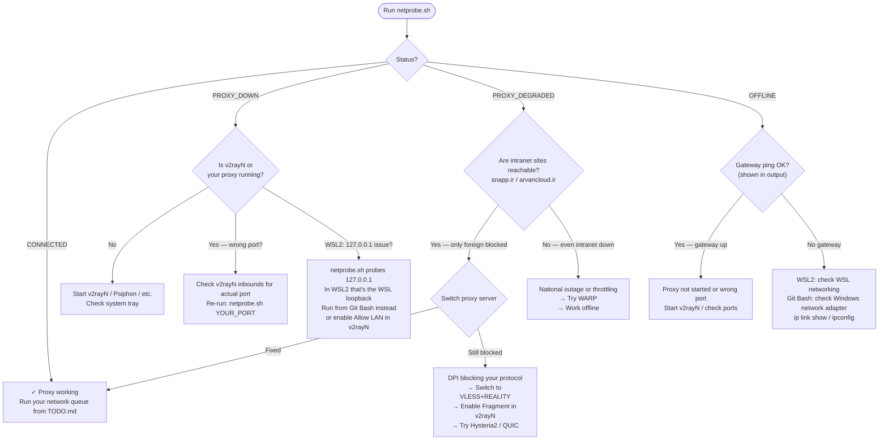

# Windows — Setup, Diagnostics, and Proxy Guide

Full Windows guide for the `disrupted-network` skill. Covers v2rayN (the most common proxy client in Iran on Windows), WSL2, Git Bash, and Claude Code path differences.

---

## Two environments: pick yours

The bash scripts (`init-session.sh`, `netprobe.sh`, `checkpoint.sh`) require bash. On Windows you have two options:

| Environment | Best for | Proxy reaches Windows host at |
|-------------|----------|-------------------------------|
| **WSL2** | Full Linux toolchain, `claude` in WSL | Windows host IP (not `127.0.0.1`) |
| **Git Bash** | Lightweight, no Linux install needed | `127.0.0.1` (same machine) |

**The critical WSL2 difference:** Inside WSL2, `127.0.0.1` is the WSL loopback, not the Windows host where v2rayN is running. You must use the Windows host IP instead. See the [WSL2 proxy setup](#wsl2-proxy-setup) section.

---

## Prerequisites

Install one of:

- **WSL2:** `wsl --install` in PowerShell (Admin). Restart. Opens an Ubuntu terminal.
- **Git Bash:** Install [Git for Windows](https://git-scm.com/download/win). Includes bash, curl, and common Unix tools.

Neither requires admin rights once installed. Git Bash is faster to set up; WSL2 is more capable.

> **`nc` (netcat) in Git Bash:** Git Bash does not include `nc` by default. Install [Nmap for Windows](https://nmap.org/download.html) — it includes `ncat`, which is compatible. Then symlink or alias: `alias nc=ncat` in your `~/.bashrc`. Alternatively, use WSL2 where `nc` is available via `apt install netcat-openbsd`.

---

## Step 1 — Install the skill

### From PowerShell

```powershell
# Create the skills directory and clone
New-Item -ItemType Directory -Force -Path "$env:USERPROFILE\.claude\skills"
git clone https://github.com/mashfie/disrupted-network "$env:USERPROFILE\.claude\skills\disrupted-network"
```

### From Git Bash

```bash
mkdir -p ~/.claude/skills
git clone https://github.com/mashfie/disrupted-network ~/.claude/skills/disrupted-network
```

### From WSL2

```bash
mkdir -p ~/.claude/skills
git clone https://github.com/mashfie/disrupted-network ~/.claude/skills/disrupted-network
```

> **Path note:** `~` in WSL2 is your WSL home (`/home/username`), not your Windows home. If you run `claude` in Windows-native mode, install the skill in the Windows path too (see [Claude Code path reference](#claude-code-path-reference)).

---

## Step 2 — Initialize session state

Run from your project directory. The script creates `.claude-session/` and auto-detects your proxy.

### From Git Bash

```bash
bash "$USERPROFILE/.claude/skills/disrupted-network/scripts/init-session.sh"
```

> If `$USERPROFILE` contains spaces (e.g., `C:\Users\Ali Hassan`), the double quotes handle it. If it still fails, use the explicit path: `bash "/c/Users/Ali Hassan/.claude/skills/disrupted-network/scripts/init-session.sh"`

### From WSL2

```bash
bash ~/.claude/skills/disrupted-network/scripts/init-session.sh
```

If your project lives on the Windows filesystem (e.g., `C:\Projects\myapp`), it's accessible from WSL2 at `/mnt/c/Projects/myapp`. Run init from there:

```bash
bash ~/.claude/skills/disrupted-network/scripts/init-session.sh /mnt/c/Projects/myapp
```

---

## Step 3 — Proxy environment variables

### Windows-native `claude` (PowerShell)

v2rayN's HTTP inbound (default port 10809) is what PowerShell's `HTTP_PROXY` expects. SOCKS5 does not work here.

```powershell
$env:HTTPS_PROXY = "http://127.0.0.1:10809"
$env:HTTP_PROXY  = "http://127.0.0.1:10809"
claude
```

To persist across all PowerShell sessions, add to your `$PROFILE`:

```powershell
# Open profile: notepad $PROFILE
$env:HTTPS_PROXY = "http://127.0.0.1:10809"
$env:HTTP_PROXY  = "http://127.0.0.1:10809"
```

### Git Bash

```bash
export HTTPS_PROXY="socks5h://127.0.0.1:10808"
export HTTP_PROXY="socks5h://127.0.0.1:10808"
claude
```

Add to `~/.bashrc` to persist.

### WSL2 proxy setup

Inside WSL2, `127.0.0.1` is the WSL loopback — not the Windows host where v2rayN is running. Use the Windows host IP instead.

**Get the Windows host IP from WSL2:**

```bash
WINDOWS_HOST=$(grep nameserver /etc/resolv.conf | awk '{print $2}')
echo $WINDOWS_HOST   # e.g., 172.30.64.1
```

**Set proxy using the host IP:**

```bash
export HTTPS_PROXY="socks5h://$WINDOWS_HOST:10808"
export HTTP_PROXY="socks5h://$WINDOWS_HOST:10808"
export all_proxy="socks5h://$WINDOWS_HOST:10808"
export no_proxy="localhost,127.0.0.1"
claude
```

Add these lines to `~/.bashrc` to persist. The host IP can change between reboots — the `grep nameserver` command always gets the current one.

**Alternative: mirrored networking (Windows 11 only)**

In `%USERPROFILE%\.wslconfig`:

```ini
[wsl2]
networkingMode=mirrored
```

With mirrored networking, WSL2 shares the Windows network stack and `127.0.0.1` works directly — no host IP lookup needed. Requires WSL2 kernel 5.15.90+ and Windows 11 22H2 or later.

---

## v2rayN — setup and port configuration

v2rayN is the most common proxy client on Windows for users in Iran. It runs as a tray app and exposes local SOCKS5 and HTTP inbound ports.

### Finding your inbound ports

1. Open v2rayN → **Settings** → **Options** → **Inbounds** tab
2. Note the **Local socks5 port** (default 10808) and **Local http port** (default 10809)
3. These are the ports you use in proxy env vars

### Enable "Allow LAN connections" for WSL2

If using WSL2, v2rayN must accept connections from the WSL2 network (not just loopback):

1. v2rayN → **Settings** → **Options**
2. Check **Allow connections from LAN**
3. Restart v2rayN

This makes v2rayN listen on `0.0.0.0` (all interfaces) so WSL2 can reach it via the Windows host IP.

### HTTP inbound vs SOCKS5 inbound

| Inbound | Port | Use for |
|---------|------|---------|
| SOCKS5 | 10808 | Linux/macOS terminal, WSL2, Git Bash |
| HTTP | 10809 | Windows-native PowerShell, CMD |

PowerShell's `HTTP_PROXY`/`HTTPS_PROXY` only accepts HTTP proxies. WSL2 and Git Bash accept SOCKS5 (use `socks5h://` to proxy DNS).

### DPI and fragmentation in v2rayN

v2rayN has a built-in **Fragment** feature for splitting the TLS ClientHello. See `linux-macos.md` → DPI section for the JSON config. Relevant if your proxy connects but `claude` specifically is blocked.

---

## Other proxy tools on Windows

### Psiphon

Psiphon for Windows runs as an `.exe` and opens a local HTTP/SOCKS proxy:

- SOCKS5: `127.0.0.1:1080`
- HTTP: `127.0.0.1:8080`

No configuration needed. Download from [psiphon3.com](https://psiphon3.com) and run — it connects automatically.

### Shadowsocks / Outline

**Shadowsocks-windows** or the **Outline client** expose a local SOCKS5 port (default 1080).

```powershell
# PowerShell (HTTP proxy — Outline may not have HTTP inbound)
# Use a local HTTP proxy bridge like Privoxy pointing to SOCKS5:1080
```

```bash
# WSL2 / Git Bash
export HTTPS_PROXY="socks5h://$WINDOWS_HOST:1080"
```

### Cloudflare WARP

WARP for Windows runs as a system service and routes traffic through Cloudflare. It can expose a local SOCKS5 proxy on port 40000, or route all traffic at the interface level.

```powershell
# Check if WARP SOCKS5 is active
Test-NetConnection -ComputerName 127.0.0.1 -Port 40000
```

```bash
# WSL2 / Git Bash — if WARP exposes SOCKS5 on host
export HTTPS_PROXY="socks5h://$WINDOWS_HOST:40000"
```

In full-tunnel mode (all traffic routed through WARP), no proxy env vars are needed for Windows-native tools — but WSL2 may still need explicit proxy settings since it has its own network stack.

### Clash for Windows / Clash Verge

Clash-based clients typically expose:
- SOCKS5: `127.0.0.1:7891`
- HTTP: `127.0.0.1:7890`

Check your Clash dashboard (usually `http://127.0.0.1:9090`) for current port assignments.

---

## Running netprobe.sh on Windows

### From Git Bash

```bash
bash .claude-session/scripts/netprobe.sh 10808
```

If `nc` is missing, install Nmap (includes `ncat`) and add to PATH. Then test:

```bash
nc -z -w 2 127.0.0.1 10808 && echo "UP" || echo "DOWN"
```

If `nc` still not found: `alias nc=ncat` in `~/.bashrc`.

### From WSL2

```bash
bash .claude-session/scripts/netprobe.sh 10808
```

**WSL2 gateway note:** `ip route` in WSL2 returns the Windows host IP as the default gateway, not your router. This is correct — WSL2 routes through the Windows network stack. The gateway ping will succeed as long as WSL2 networking is functioning. The SOCKS5 probe must use the Windows host IP (not `127.0.0.1`) — pass the full host address or ensure `SOCKS5_PORT` probe is reaching the right host.

> `netprobe.sh` currently probes `127.0.0.1:PORT` for SOCKS5. In WSL2, this reaches the WSL loopback, not v2rayN on the Windows host. If you're in WSL2, run `netprobe.sh` from a Git Bash terminal instead, where `127.0.0.1` correctly reaches v2rayN. Or enable v2rayN's "Allow LAN connections" and test reachability manually: `nc -z -w 2 $WINDOWS_HOST 10808`.

---

## Diagnostic flowchart

Run `netprobe.sh` first, then follow your result:



> Renders in VS Code Markdown Preview, Obsidian, and Typora.

---

## Claude Code path reference

| Environment | Skills directory | Session state |
|-------------|-----------------|---------------|
| Windows-native `claude.exe` | `%USERPROFILE%\.claude\skills\` | In project root: `.claude-session\` |
| WSL2 `claude` | `~/.claude/skills/` (WSL home) | In project root: `.claude-session/` |
| Git Bash `claude` | `~/.claude/skills/` (Windows home via Git Bash) | In project root: `.claude-session/` |

If you run `claude` in PowerShell but run the bash scripts from WSL2, the `.claude-session/` directory must be in the same project root that both environments can see. For a project at `C:\Projects\myapp`, the Windows path is `C:\Projects\myapp\.claude-session\` and the WSL2 path is `/mnt/c/Projects/myapp/.claude-session/` — they are the same directory.

---

## Common Windows-specific failures

### `nc: command not found` in Git Bash

Git Bash does not include netcat. Fix:

1. Install [Nmap for Windows](https://nmap.org/download.html) (includes `ncat`)
2. Ensure Nmap's directory is in your PATH (the installer offers this)
3. Add `alias nc=ncat` to `~/.bashrc`

### WSL2 proxy env vars not reaching v2rayN

`export HTTPS_PROXY="socks5h://127.0.0.1:10808"` fails silently in WSL2 because `127.0.0.1` is the WSL loopback. Fix: use the Windows host IP.

```bash
WINDOWS_HOST=$(grep nameserver /etc/resolv.conf | awk '{print $2}')
export HTTPS_PROXY="socks5h://$WINDOWS_HOST:10808"
```

Or enable **Allow LAN connections** in v2rayN.

### Windows Defender blocking nc/ncat

Windows Defender may block `ncat` on first run. Allow it: **Windows Security → Firewall → Allow an app through firewall → ncat**.

### Git Bash path with spaces

If your Windows username has a space, `$USERPROFILE` expands with spaces. Always quote:

```bash
bash "$USERPROFILE/.claude/skills/disrupted-network/scripts/init-session.sh"
```

### PowerShell ExecutionPolicy

The bash scripts (`.sh`) are not affected by PowerShell's `ExecutionPolicy`. Run them with `bash script.sh`, not `.\script.sh`. If you see "cannot be loaded because running scripts is disabled", you are trying to run a `.ps1` file — use bash instead.

### Git Bash `~` vs Windows home

In Git Bash, `~` maps to your Windows home (`C:\Users\username`). If Claude Code skills are installed at `~/.claude/skills/` from Git Bash, they are at `C:\Users\username\.claude\skills\` — the same location that Windows-native `claude.exe` looks for them. No path mismatch.

### v2rayN not listening after Windows restart

v2rayN does not start automatically by default. Enable auto-start: **v2rayN tray icon → right-click → Auto-start on boot**, or add v2rayN to `shell:startup`.
